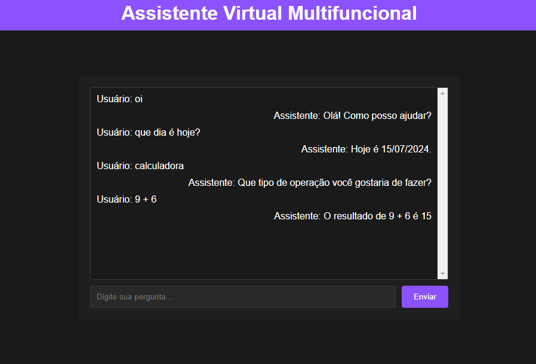

<h1 align="center"> Projeto Assistente Virtual </h1>

Projeto criado para um trabalho escolar.

  <a href="#-tecnologias">Tecnologias</a>&nbsp;&nbsp;&nbsp;|&nbsp;&nbsp;&nbsp;
  <a href="#-projeto">Projeto</a>&nbsp;&nbsp;&nbsp;|&nbsp;&nbsp;&nbsp;
  <a href="#-licença">Licença</a>

  

 

  

## 🚀 Tecnologias

Esse projeto foi desenvolvido com as seguintes tecnologias:

- HTML e CSS
- JavaScript
- Git e Github
- Figma

## 💻 Projeto

O projeto Assitente vitual foi desenvolvido com a ideia de ajudar pessoas com dificuldades, problemas de saúde e pessoas especiais. Projetado para interagir com os usuários através de um chatbot. Aqui estão algumas funcionalidades que ele oferece:

- Interação por Texto: Os usuários podem digitar perguntas ou comandos no campo de entrada de texto.
- Respostas Automatizadas: O assistente virtual responde automaticamente com base nas entradas dos usuários.
- Interface de Usuário: A interface é simples e intuitiva, com uma área de chat para mostrar as mensagens e um campo de entrada para enviar novas mensagens.
  
- Acesse o projeto [AQUI](https://yuriverwiebe.github.io/virtual_assitent_web)

## 📝 Licença

Esse projeto está sob a licença MIT.

---

Feito com ♥ by Yuri Verwiebe 🌊
